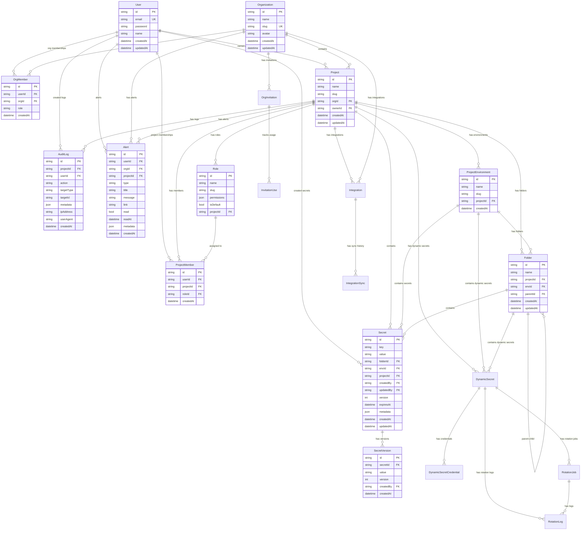

# Database Schema

## Entity Relationship Diagram



## Models

### User
- System user account
- Unique email address
- Password hashed with bcrypt

### Organization
- Top-level container for projects
- Has members with roles (owner, admin, member)
- Unique slug for URL routing

### Project
- Belongs to one organization
- Has one owner and multiple members
- Contains environments, folders, secrets
- Unique slug per organization

### ProjectEnvironment
- Represents deployment environments (dev, staging, prod)
- Belongs to a project
- Unique slug per project

### Folder
- Hierarchical organization of secrets
- Can be nested (parent-child)
- Belongs to project and environment

### Secret
- Actual secret key-value pairs
- Encrypted with AES-256-GCM
- Versioned for change tracking
- Belongs to project, environment, folder

### SecretVersion
- History of secret value changes
- Tracks who changed what and when

### Role
- Project-level permissions
- JSON array of permission strings
- Assigned to project members

### ProjectMember
- Links users to projects with roles
- One role per user per project

### OrgMember
- Links users to organizations
- Role at org level (owner, admin, member)

### AuditLog
- Tracks all actions in projects
- Includes IP address and user agent

### Alert
- User notifications
- Can be at user, org, or project level
- Types: info, warning, error, success, secret_expiry, security, etc.

### DynamicSecret
- Dynamically generated credentials (PostgreSQL, MySQL, MongoDB, Redis)
- Config encrypted at rest using AES-256-GCM
- Supports scheduled rotation via cron expression
- Generates temporary credentials stored encrypted

### DynamicSecretCredential
- Individual generated username/password pairs
- Password encrypted at rest
- Has optional expiration timestamp

### RotationJob
- Cron-scheduled rotation jobs
- Linked to a single DynamicSecret
- Tracks last run and next run timestamps

### RotationLog
- History of rotation attempts
- Records success/failure status and error messages

### Integration
- External service connections (GitHub, AWS, Azure, Slack)
- Config encrypted at rest
- Tracks last sync timestamp

### IntegrationSync
- History of sync operations
- Records direction (push/pull), status, secrets count

### OrgInvitation
- Invitation codes for organization membership
- Supports email restriction and usage limits
- Expiration support

### InvitationUse
- Tracks which user used which invitation
- One use per user per invitation

## Performance Indexes

15 indexes are defined for high-traffic query patterns:

| Model | Index | Purpose |
|-------|-------|---------|
| `Secret` | `[projectId]`, `[projectId, envId]`, `[expiresAt]` | List, filter, expiry cron |
| `AuditLog` | `[projectId, createdAt]`, `[targetId]` | Project logs, target lookups |
| `Folder` | `[projectId, envId]` | Folder listing by project+env |
| `DynamicSecret` | `[projectId, envId]` | Dynamic secret listing |
| `RotationJob` | `[isActive, nextRunAt]` | Rotation scheduler |
| `Project` | `[orgId]` | Org-scoped projects |
| `ProjectMember` | `[projectId]`, `[userId]` | Membership lookups |
| `Role` | `[projectId]` | Role lookup |
| `SecretVersion` | `[secretId]` | Version history FK |
| `InvitationUse` | `[invitationId]` | Invitation usage |
| `IntegrationSync` | `[integrationId, createdAt]` | Sync history |
| `OrgInvitation` | `[orgId, createdAt]`, `[code]` | Invitation listing |

## Migration Strategy

This project uses Prisma with the following migration approach:

```bash
# Create a migration
npx prisma migrate dev --name migration_name

# Apply migrations to production
npx prisma migrate deploy

# Reset database (development only)
npx prisma migrate reset

# Push schema changes (prototyping)
npx prisma db push
```

### Key Points

1. **Prisma Migrate** is used for schema changes
2. **Cascade deletes** are configured for related data
3. **Unique constraints** prevent duplicate entries
4. **Indexes** are added for frequently queried fields

### Running Migrations

```bash
# Development
npm run dev
# Prisma automatically applies migrations on startup

# Create new migration
npx prisma migrate dev --name add_new_field

# Production deployment
npx prisma migrate deploy
```
